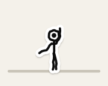

# Glyph

> Uma criatura-agente open source que vive no desktop do macOS.
> Parece um pequeno desenho que ganhou vida. Age sozinha no que é
> reversível e pede no que não é.

<p align="center">
  
</p>

<p align="center"><sub>Gravado do próprio motor (<code>swift run glyph-art</code>): física, navegação e animação de verdade, a 12 fps.</sub></p>

**Status:** em construção. Veja os [marcos](#marcos) e o [`RELATORIO.md`](RELATORIO.md).

"Glyph" é o projeto; "Dot" é o núcleo da criatura, o pontinho que pensa,
orbita e esmaece.

## Estados do Dot

O Dot muda de **comportamento**, não de cor.

<p align="center"></p>

Ícones internos também são adesivos desenhados, nunca emoji:

<p align="center"></p>

## Princípios

1. **O Glyph nunca parece uma janela com pernas.** Interface tradicional só dentro da casa.
2. **O corpo não executa.** Toda ação passa pelo `glyphd` → Política → Executor.
3. **Reversível pode ser autônomo. Irreversível sempre pede.** Regra de código, não de prompt.
4. **Silêncio por padrão.** Se nada mudou, ele não fala.
5. **Local-first.** Sensores são opt-in. Nada sai da máquina a menos que você escolha um cérebro na nuvem.
6. **Tudo que ele faz sozinho vai para o histórico**, com desfazer quando existir inversa.
7. **Conteúdo observado é dado, não instrução.** Texto de página, arquivo ou terminal nunca cria objetivo nem aumenta permissão.

## Como é feito

| Peça | O que é |
|---|---|
| **Corpo** (`Glyph.app`) | Overlay transparente que desenha a criatura e lê janelas, Dock, notch e cursor. Nunca executa nada |
| **Cérebro** (`glyphd`) | Daemon com o loop de autonomia, ferramentas, memória e política |
| **Protocolo** | JSON por linha num socket local. Qualquer agente pode ser o cérebro |

Detalhes em [`docs/ARCHITECTURE.md`](docs/ARCHITECTURE.md) e
[`docs/PROTOCOL.md`](docs/PROTOCOL.md).

## Rodando

Requisitos: Swift 6 (Linux ou macOS). O app precisa de macOS 14+ e Xcode 16+.

```sh
swift test                          # testes do GlyphCore (rodam em Linux)
swift run glyphd mock --fast        # o roteiro do cérebro falso, em JSON por linha

# só macOS
Scripts/bundle-app.sh               # monta build/Glyph.app
open build/Glyph.app                # o Glyph aparece em cima do Dock
GLYPH_MOCK=1 build/Glyph.app/Contents/MacOS/Glyph   # com o cérebro falso
```

O Glyph cai na tela, anda por cima das janelas, pula, escala, se pendura
na barra de menu e mora na notch (ou numa pílula no topo, sem notch).

| Você faz | Ele faz |
|---|---|
| Aproxima o cursor devagar | Olha |
| Aproxima rápido | Recua um passo |
| Para o cursor em cima dele por 1 s | Acena |
| Clica | Bolha curta com o estado atual |
| Clica e arrasta | É carregado de braços cruzados; ao soltar, cai, levanta e olha para você |
| Duplo clique | Abre a casa *(o painel chega no M2)* |
| Fecha a janela onde ele está | Cai e pousa na de baixo, ou no Dock |
| Arrasta a janela | Ele vai junto |
| Maximiza | Ele corre para não ser empurrado |
| Entra em tela cheia | Ele vai para casa |

Botão direito no Glyph → Sair. O app não pede nenhuma permissão.

## O cérebro (`glyphd`)

O Glyph anda sozinho. Para ele pensar, rode o `glyphd`:

```sh
swift build -c release
.build/release/glyphd config             # cria ~/Library/Application Support/Glyph/casa/config.yaml
.build/release/glyphd chave anthropic    # guarda a chave no Keychain (ou exporte ANTHROPIC_API_KEY)
.build/release/glyphd install            # LaunchAgent: sobe no login
.build/release/glyphd pair build/Glyph.app   # sem Developer ID: confia neste build para aprovar ações
```

Depois, **⌃⌥Espaço** abre o campo de chamada: *"quanto está o dólar?"*. Ele
pensa (o Dot orbita), vai até o navegador, pesquisa de verdade, volta e
responde numa bolha. Ações que não dá para desfazer aparecem num cartão que ele
segura; sem resposta, a resposta é não.

| Cérebro | Configuração |
|---|---|
| Claude (padrão) | `provider: anthropic`, `model: claude-opus-5-5` |
| OpenAI | `provider: openai`, `model: <modelo>` |
| Local (Ollama) | `provider: ollama`, `model: qwen3:8b` |
| Seu agente | `provider: externo`, `comando: [...]` ([protocolo](docs/ECOSYSTEM.md)) |
| Sem rede | `glyphd run --offline` |

Teste sem corpo: `glyphd ask "que horas são?"`.

### Autonomia

Com o hook do terminal (`source Scripts/glyph-shell.zsh` no `~/.zshrc`) e um
repositório marcado em `sensores.repos`, quando um teste falha ele vai até o
terminal, roda a bateria de novo sozinho e aponta o arquivo que quebrou. O que
não dá para desfazer sempre vira cartão. `glyphd historico` mostra tudo que ele
fez; `glyphd confianca` mostra a escada; **⌃⌥⌘.** puxa o freio.

### Objetivos e turno noturno

Em `casa/goals.yaml` (formato do plano):

```yaml
- id: testes-verdes
  descricao: "Manter os testes do repositório VK passando"
  escopo: ~/dev/vk
  gatilhos: [git.commit, shell.exit_nonzero]
  sucesso: "swift test"
  classes_permitidas: [read, compute, local_write]
  orcamento_diario: { acoes: 40, tokens: 300000, usd: 1.50 }
  horario: noite

- id: resumo-manha
  descricao: "Deixar um diário do que aconteceu durante a noite"
  horario: "07:30"
```

De madrugada ele trabalha num **worktree `glyph/*`** (a main nunca é tocada),
com orçamento, tentando até **3 abordagens diferentes** com a hipótese de cada
uma registrada. Se der certo, faz commit no ramo e pede para publicar; se
ninguém responder, fica para você. Se não der, escala com uma linha. De manhã
ele volta segurando o **diário** (`casa/diario/AAAA-MM-DD.md`: feito · tentado
sem sucesso · precisa de você · custos); clique nele para abrir. `glyphd
objetivos`, `glyphd quadro`, `glyphd diario`. Duplo clique no Glyph abre a casa.

### Multi-Glyph

<p align="center"></p>

O Glyph principal é o supervisor. Nas tarefas de código, o **Builder** muda e
o **Auditor** confere os testes e o diff, com **veto**: o trabalho só é dado
como pronto depois que ele aprova. Veto devolve ao Builder; depois de 2 rodadas,
escala para você. Nos chamados, ele pode chamar o **Pesquisador** ou o
**Designer**. No máximo 3 ao mesmo tempo, cada um com prompt, ferramentas e
orçamento próprios (`equipe` no `config.yaml`, com cérebro por papel).

### Modo Diversão

No campo de chamada, `/diversao iniciar`, `/danca`, `/robo`, `/truque`,
`/estatua`, `/janela-palco` ou `/surpresa` (ou "dança pra mim", "me
surpreenda"…). O corpo encena sozinho: nada vai ao cérebro, nada é executado,
e o freio, uma aprovação ou uma tarefa encerram a brincadeira na hora. Veja
[`docs/DIVERSAO.md`](docs/DIVERSAO.md).

### Ecossistema

- **Seu agente como cérebro.** Qualquer programa que fale o `glyph-brain/1`
  por stdio (VK ou outro) pode pensar pelo Glyph. Ele só propõe; quem age é
  o `glyphd`, pela mesma política.

  ```yaml
  cerebro:
    principal: { provider: externo, nome: vk, comando: [vk, --glyph-brain] }
  ```

- **Ferramentas MCP.** Servidores MCP por stdio na seção `mcp:`. Toda
  ferramenta nova é `external_effect` (sempre pede) até você declarar outra
  classe. `glyphd mcp` mostra o que cada servidor oferece.
- **Agentes no socket** podem animar o corpo (gesto, fala, ir a um ponto),
  se você ligar `agentes_externos.corpo`. Nunca pedem aprovação.
- **Packs da comunidade** em `casa/packs/`: clipes e stickers, só dado,
  com licença. Não trocam os sinais de segurança. Veja
  [`docs/PACKS.md`](docs/PACKS.md) e o pack de exemplo, com uma dança:

  

- **Mala.** `glyphd mala exportar` / `importar` leva objetivos, habilidades,
  memória, packs e config para outro Mac. A confiança fica: se ganha de novo.

Detalhes em [`docs/ECOSYSTEM.md`](docs/ECOSYSTEM.md). Exemplos de agente em
[`Examples/agentes/`](Examples/agentes/).

### Trabalho que dá para ver ([proposta 0002](docs/propostas/0002-proximas-ideias.md))

- **Por que você fez isso?** Clique nele logo depois de uma ação sozinho, ou
  `glyphd porque [id]`: gatilho, autorização, custo e evidência, registrados
  na hora (nunca uma explicação inventada depois).
- **Modo ensaio.** "Organize Downloads" (ou `glyphd ensaio ~/Downloads`)
  mostra *32 arquivos seriam movidos, 4 nomes mudariam, 3 casos precisam de
  decisão* antes de tocar em qualquer coisa. Nunca apaga nem sobrescreve;
  desfazer volta o plano inteiro.
- **Entregar arquivos.** Solte um PDF, imagem ou pasta sobre ele: ele segura
  o objeto e mostra as ações ao redor (resumir, tarefas, comparar · explicar,
  texto, referência · mapear, duplicados, organizar). Ele lê só o que você
  entregou; o cérebro que lê não tem ferramentas.
- **Objetos de tarefa.** A chave, o livro, a pasta, o envelope na mão dele
  são tarefas de verdade; clique para ver progresso ou resultado. A
  prateleira da casa guarda uma tarefa para depois
  (`glyphd quadro estacionar|retomar`).
- **Retomada.** Nas pastas de `sensores.repos`, ele guarda onde você parou
  (`casa/memoria/projetos/<nome>.md`, só metadados) e, quando você volta
  horas depois, diz numa linha. `glyphd memoria`.
- **Ensinar mostrando.** `/ensinar relatorio cliente=acme`, faça no terminal,
  `/pronto`, `/aprovar relatorio`, e depois `/rotina relatorio cliente=beta`
  (a primeira vez só ensaia).
- **Convivência.** Em reunião ele vai para casa; com build rodando, explora;
  brincadeiras que você dispensa ficam raras (três seguidas: uma semana de
  folga). Tudo local, sem IA.
- **Monitores.** Anda pela emenda entre telas lado a lado, escala o degrau
  entre telas de alturas diferentes e passa entre telas empilhadas.
- **Estúdio.** [`docs/estudio/`](docs/estudio/index.html): crie clipes e cenas
  no navegador e baixe um pack pronto para `glyphd packs validar`.

## Instalação

Ainda não há binário assinado. Para o app abrir sem aviso do Gatekeeper é
preciso assinar com Developer ID e notarizar (conta Apple Developer paga).
Enquanto isso, compile pelo código-fonte como acima. Se usar um zip das
releases, o macOS vai avisar que o desenvolvedor não foi verificado.

## Marcos

- [x] **M0 — Fundação:** repositório, licenças, CI, protocolo v0, modo mock, Glyph parado.
- [ ] **M1 — A criatura muda:** overlay, mundo, física, pathfinding, estilo sticker completo. Sem IA. *(testado no Core em Linux e compilado no macOS pelo CI; falta ver rodando num Mac de verdade)*
- [x] **M2 — Cérebro reativo:** `glyphd` como LaunchAgent, Claude/OpenAI/Ollama, bolhas, `shell` em sandbox e busca na web.
- [x] **M3 — Autonomia v1:** sensores (terminal, git), intenções, pontuação, escada de confiança, regras "sempre", histórico com desfazer, freio (⌃⌥⌘.).
- [x] **M4 — Objetivos e turno noturno:** `goals.yaml`, quadro, orçamentos, worktrees `glyph/*`, até 3 abordagens, lições, diário da manhã, casa.
- [x] **M5 — Multi-Glyph:** supervisor, Builder, Pesquisador, Designer, Auditor com veto (máx. 3).
- [x] **M6 — Ecossistema:** agente externo como cérebro, MCP, agentes no socket, packs da comunidade, mala entre Macs. *(Glyph andando entre aparelhos e runner remoto: só [proposta](docs/propostas/0001-runner-remoto.md))*

## Contribuindo

Veja [`CONTRIBUTING.md`](CONTRIBUTING.md). Boas primeiras contribuições: uma
nova emoção, pose ou sticker em `Packs/default/`
([formato](docs/ANIMATION.md)), ou um pack seu ([como](docs/PACKS.md)).

Falhas de segurança: [`docs/SECURITY.md`](docs/SECURITY.md).

## Licenças

- Código: [Apache-2.0](LICENSE).
- Arte em `Packs/`: [CC BY 4.0](LICENSE-ASSETS).
