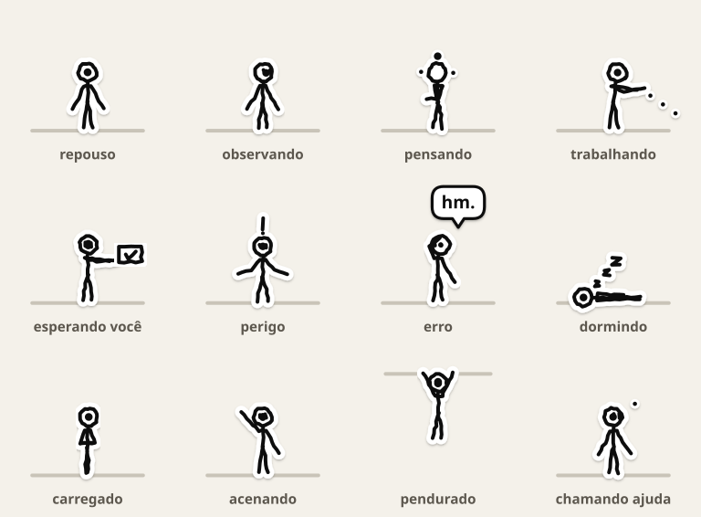
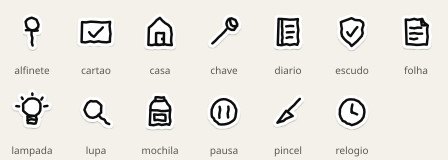

# Glyph

> Uma criatura-agente open source que vive no desktop do macOS.
> Parece um pequeno desenho que ganhou vida. Age sozinha no que é
> reversível e pede no que não é.

<p align="center">
  
</p>

<p align="center"><sub>Gravado do próprio motor (<code>swift run glyph-art</code>): física, navegação e animação de verdade, a 12 fps.</sub></p>

**Status:** em construção. Veja os [marcos](#marcos) e o [`RELATORIO.md`](RELATORIO.md).

"Glyph" é o projeto; "Dot" é o núcleo da criatura, o pontinho que pensa,
orbita e esmaece.

## Estados do Dot

O Dot muda de **comportamento**, não de cor.

<p align="center"></p>

Ícones internos também são adesivos desenhados, nunca emoji:

<p align="center"></p>

## Princípios

1. **O Glyph nunca parece uma janela com pernas.** Interface tradicional só dentro da casa.
2. **O corpo não executa.** Toda ação passa pelo `glyphd` → Política → Executor.
3. **Reversível pode ser autônomo. Irreversível sempre pede.** Regra de código, não de prompt.
4. **Silêncio por padrão.** Se nada mudou, ele não fala.
5. **Local-first.** Sensores são opt-in. Nada sai da máquina a menos que você escolha um cérebro na nuvem.
6. **Tudo que ele faz sozinho vai para o histórico**, com desfazer quando existir inversa.
7. **Conteúdo observado é dado, não instrução.** Texto de página, arquivo ou terminal nunca cria objetivo nem aumenta permissão.

## Como é feito

| Peça | O que é |
|---|---|
| **Corpo** (`Glyph.app`) | Overlay transparente que desenha a criatura e lê janelas, Dock, notch e cursor. Nunca executa nada |
| **Cérebro** (`glyphd`) | Daemon com o loop de autonomia, ferramentas, memória e política |
| **Protocolo** | JSON por linha num socket local. Qualquer agente pode ser o cérebro |

Detalhes em [`docs/ARCHITECTURE.md`](docs/ARCHITECTURE.md) e
[`docs/PROTOCOL.md`](docs/PROTOCOL.md).

## Rodando

Requisitos: Swift 6 (Linux ou macOS). O app precisa de macOS 14+ e Xcode 16+.

```sh
swift test                          # testes do GlyphCore (rodam em Linux)
swift run glyphd mock --fast        # o roteiro do cérebro falso, em JSON por linha

# só macOS
Scripts/bundle-app.sh               # monta build/Glyph.app
open build/Glyph.app                # o Glyph aparece em cima do Dock
GLYPH_MOCK=1 build/Glyph.app/Contents/MacOS/Glyph   # com o cérebro falso
```

O Glyph cai na tela, anda por cima das janelas, pula, escala, se pendura
na barra de menu e mora na notch (ou numa pílula no topo, sem notch).

| Você faz | Ele faz |
|---|---|
| Aproxima o cursor devagar | Olha |
| Aproxima rápido | Recua um passo |
| Para o cursor em cima dele por 1 s | Acena |
| Clica | Bolha curta com o estado atual |
| Clica e arrasta | É carregado de braços cruzados; ao soltar, cai, levanta e olha para você |
| Duplo clique | Abre a casa *(o painel chega no M2)* |
| Fecha a janela onde ele está | Cai e pousa na de baixo, ou no Dock |
| Arrasta a janela | Ele vai junto |
| Maximiza | Ele corre para não ser empurrado |
| Entra em tela cheia | Ele vai para casa |

Botão direito no Glyph → Sair. O app não pede nenhuma permissão.

## O cérebro (`glyphd`)

O Glyph anda sozinho. Para ele pensar, rode o `glyphd`:

```sh
swift build -c release
.build/release/glyphd config             # cria ~/Library/Application Support/Glyph/casa/config.yaml
.build/release/glyphd chave anthropic    # guarda a chave no Keychain (ou exporte ANTHROPIC_API_KEY)
.build/release/glyphd install            # LaunchAgent: sobe no login
.build/release/glyphd pair build/Glyph.app   # sem Developer ID: confia neste build para aprovar ações
```

Depois, **⌃⌥Espaço** abre o campo de chamada: *"quanto está o dólar?"*. Ele
pensa (o Dot orbita), vai até o navegador, pesquisa de verdade, volta e
responde numa bolha. Ações que não dá para desfazer aparecem num cartão que ele
segura; sem resposta, a resposta é não.

| Cérebro | Configuração |
|---|---|
| Claude (padrão) | `provider: anthropic`, `model: claude-opus-5-5` |
| OpenAI | `provider: openai`, `model: <modelo>` |
| Local (Ollama) | `provider: ollama`, `model: qwen3:8b` |
| Sem rede | `glyphd run --offline` |

Teste sem corpo: `glyphd ask "que horas são?"`.

### Autonomia

Com o hook do terminal (`source Scripts/glyph-shell.zsh` no `~/.zshrc`) e um
repositório marcado em `sensores.repos`, quando um teste falha ele vai até o
terminal, roda a bateria de novo sozinho e aponta o arquivo que quebrou. O que
não dá para desfazer sempre vira cartão. `glyphd historico` mostra tudo que ele
fez; `glyphd confianca` mostra a escada; **⌃⌥⌘.** puxa o freio.

## Instalação

Ainda não há binário assinado. Para o app abrir sem aviso do Gatekeeper é
preciso assinar com Developer ID e notarizar (conta Apple Developer paga).
Enquanto isso, compile pelo código-fonte como acima. Se usar um zip das
releases, o macOS vai avisar que o desenvolvedor não foi verificado.

## Marcos

- [x] **M0 — Fundação:** repositório, licenças, CI, protocolo v0, modo mock, Glyph parado.
- [ ] **M1 — A criatura muda:** overlay, mundo, física, pathfinding, estilo sticker completo. Sem IA. *(código pronto e testado no Core; falta validar no macOS)*
- [x] **M2 — Cérebro reativo:** `glyphd` como LaunchAgent, Claude/OpenAI/Ollama, bolhas, `shell` em sandbox e busca na web.
- [x] **M3 — Autonomia v1:** sensores (terminal, git), intenções, pontuação, escada de confiança, regras "sempre", histórico com desfazer, freio (⌃⌥⌘.).
- [ ] **M4 — Objetivos e turno noturno:** `goals.yaml`, orçamentos, worktrees, diário da manhã.
- [ ] **M5 — Multi-Glyph:** supervisor, Builder, Pesquisador, Auditor com veto.
- [ ] **M6 — Ecossistema:** agentes externos, packs da comunidade, viagem entre dispositivos.

## Contribuindo

Veja [`CONTRIBUTING.md`](CONTRIBUTING.md). Boas primeiras contribuições: uma
nova emoção, pose ou sticker em `Packs/default/`
([formato](docs/ANIMATION.md)).

Falhas de segurança: [`docs/SECURITY.md`](docs/SECURITY.md).

## Licenças

- Código: [Apache-2.0](LICENSE).
- Arte em `Packs/`: [CC BY 4.0](LICENSE-ASSETS).
